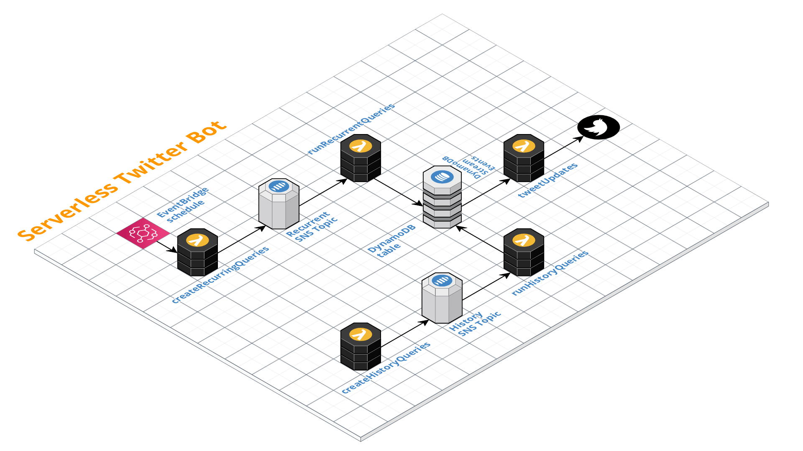

# serverless-twitter-bot
An example application which tweets GitHub repo releases, running on AWS Lambda, EventBridge, SNS and DynamoDB. Built with the [Serverless framework](https://goserverless.com).

## Architecture



## How does the project work?
This project pulls a repository's relese or tag information from the GitHub GraphQL API, checks whether there are new releases, and if there are, tweets them out with a standardized tweet message linking to the GitHub release page.

As we want to compare existing (history) releases/tags with new ones, the architecture has two different "streams" which create/load repository information.

* The repo histories needs to be loaded to be able to check for new versions (see below). The info about the release versions will be stored in DynamoDB.
* There's a recurrent trigger which runs every 10min, and will create SNS messages, one per repo, which are then consumed by another function which queries the GitHub GraphhQL API for the release/tag info, compare the result to what is currently stored in the DynamoDB table, and insert new records

Another Lambda function will consume the DynamoDB stream's INSERT records, and use the contained information to send out the respective tweets

## Preparations
There are several steps you have to take until you can launch this application.
### Create a Twitter app to receive an API key and Access Token
Go to [developer.twitter.com](https://developer.twitter.com/), create a new project and a new app. Probably you have to fill out their survey for new application. 

**Make sure you use your desired Twitter account before you create the app! Creating a separate Twitter account before using this application is recommended.**

It can take 1-2 days until you'll receive a feedback for your new application from Twitter.
### Create a GitHub Access Token
As we're pulling repository releases via the GitHub GraphQL API, you'll need a GitHub Access Token for this project. Have a look at the [GitHub docs](https://docs.github.com/en/authentication/keeping-your-account-and-data-secure/creating-a-personal-access-token) about how you can do this.

### Clone the project

```bash
$ git clone git@github.com:tobilg/serverless-twitter-bot.git && cd serverless-twitter-bot
```
### Prepare a .env file
You need to add the gathered information of the last steps to create a new `.env` file in the cloned project's root folder with the following structure:

```bash
# GitHub credentiatials
GITHUB_ACCESS_TOKEN=

# Twitter credentiatials
TWITTER_CONSUMER_KEY=
TWITTER_CONSUMER_SECRET=
TWITTER_ACCESS_TOKEN=
TWITTER_ACCESS_TOKEN_SECRET=
```

You can get the information from the GitHub profile page, and the acording Twitter application settings.

### Configure the repositories you're interested in
To configure the repositories you want to twwet release updates from, you can adapt the `repos` array in the [src/lib/repos.js](src/lib/repos.js#L20). By default, the AWS JS SDK is used as example repo.

The create a new entry, you should use the following structure:

```javascript
{
  description: "AWS SDK for Javascript",
  gitHubOrganizationName: "aws",
  gitHubRepoName: "aws-sdk-js",
  gitHubDataType: "releases",
  filter: "no-prerelease"
}
```

The most important properties are `gitHubOrganizationName` (the organization/user name), and the `gitHubRepoName` (the name of the actual repo). E.g. if the repository URL is `https://github.com/aws/aws-sdk-js`, then the `gitHubOrganizationName` would be `aws` and the `gitHubRepoName` would be `aws-sdk-js`.

The `gitHubDataType` can be used to distinguish between `releases` or `tags`. To filter out pre-releases, you can apply the `filter` property as shown above.
## Deployment

### Deploy to AWS
If you have installed the Serverless framework (and configured the AWS accordingly), as well as having finalized all the preparations above, you can deploy the stack:

```bash
$ sls deploy
```

### Trigger initial history load
To be able to compare the potential new releases/tags, the history needs to be loaded (once and manually), by issueing

```bash
$ sls invoke -f createHistoryQueries
```

This can take a while, depending on how many repos you configured, and how many releases/tags their are having.

### Check if everything works
If everything works as desired, you should automatically see the tweets created automatically by this project.

You can also check the logs with

```bash
$ sls logs -f $FUNCTIONNAME
```

and check the entries in the respective DynamoDB table.

### Feeback
Feel free to create an issue if you encounter any problems with this project.